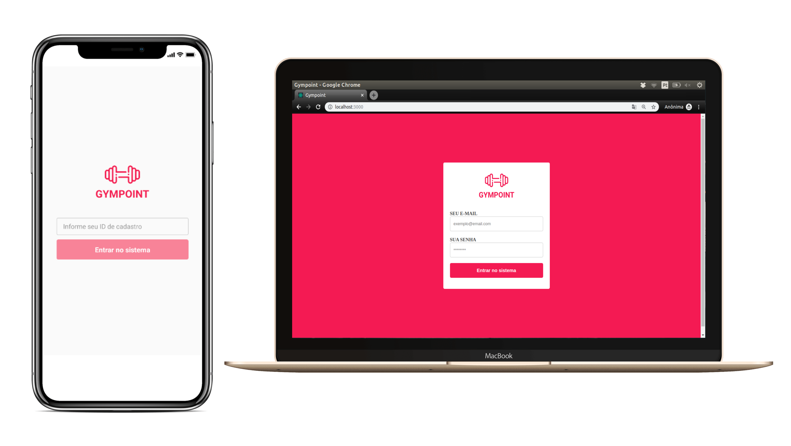

<h1 align="center">
  
</h1>

<h3 align="center">
  Gympoint, Frontend, Mobile e Backend
</h3>

<blockquote align="center">“Mude você e todo o resto mudará naturalmente”!</blockquote>

  <a href="#-tecnologias">Tecnologias</a>&nbsp;&nbsp;&nbsp;|&nbsp;&nbsp;&nbsp;
  <a href="#-projeto">Projeto</a>&nbsp;&nbsp;&nbsp;|&nbsp;&nbsp;&nbsp;
  <a href="#-instalação-e-execução">Instalação e execução</a>&nbsp;&nbsp;&nbsp;|&nbsp;&nbsp;&nbsp;
  <a href="#-licença">Licença</a>

 

  

## 🚀 Tecnologias

Esse projeto foi desenvolvido com as seguintes tecnologias:

- [Node.js](https://nodejs.org/en/)
- [React](https://reactjs.org)
- [React Native](https://facebook.github.io/react-native/)

## 💻 Projeto

A aplicação desenvolvida neste projeto é um app gerenciador de academia, o Gympoint. Esse app tem seu backend construído em node que fornece uma api para ser consumida pelo aplicações web e mobile. 

A aplicação Web por sua vez é voltada para a gerência academia, onde funcionalidades, como: CRUDs de alunos, matrículas e planos foram implementados, além tela de ajuda aos alunos.

Já aplicação mobile é direcionada aos alunos da academia, onde os mesmo poderão realizar check-ins, efetuar, listar e visualizar seus pedidos de ajuda com suas respectivas respostas.

## 📥 Instalação e execução

Faça um clone desse repositório

  ### Backend
  1. A partir da raiz do projeto, entre na pasta rodando `cd backend`;
  2. Execulte `npm install` ou `yarn` para instalar as dependências;
  2. Execulte `node ./init.js` para preencher as variáveis de ambiente;
  3. Execulte `docker-compose up` para iniciar o servidor backend com todos os bancos de bados;
  
  ### Frontend
  1. A partir da raiz do projeto, entre na pasta rodando `cd frontend`;
  2. Execulte `npm install` para instalar as dependências;
  3. Execulte `npm run start` para iniciar o servidor de desenvolvimento;
  4. Abra `http://localhost:3000` para ver o projeto no navegador.

  ### Mobile
  1. A partir da raiz do projeto, entre na pasta rodando `cd mobile`;
  2. Execulte `npm install` para instalar as dependências;
  3. Execulte `npm run start` para iniciar o servidor de desenvolvimento;
  4. Cheque o ip do servidor e substitua `localhost` do atributo `baseURL` no arquivo `src > services > api.js`;
  5. Execulte `npm run android` para iniciar a instalação no smartphone;
  
  <i>Obs.:</i> Projeto mobile desenvolvido apenas para a plataforma <strong>android</strong>.

## 📝 Licença

Esse projeto está sob a licença MIT. Veja o arquivo [LICENSE](LICENSE.md) para mais detalhes.
